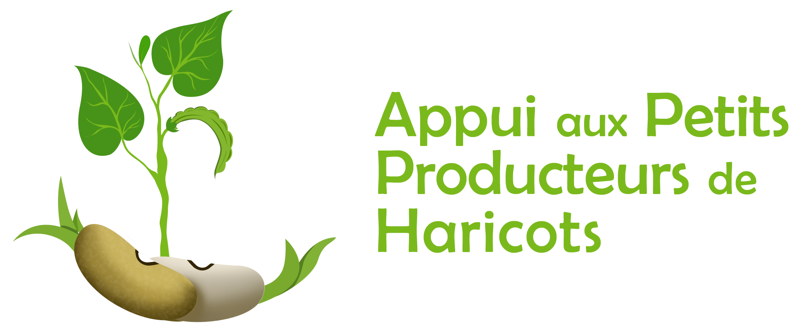

---
Application mobile de présentation de la culture du haricot made in Congo et de la valorisation des producteurs de haricot.

- Madede vise à diffuser un message positif pour inspirer d'autres agriculteurs, tout en incitant les
congolais et congolaises à consommer ces haricots.
- Madede est un outil pédagogique destiné à la vulgarisation de la production et de la
consommation du haricot en République du Congo.

Madede est disponible en ligne, pour Windows / Mac / Linux et pour les smartphones Android et IOS.

## Les différentes rubriques de Madede

### Recette
Une liste des recettes à base du haricot.

Cette base de données est en constante évolution. Les recettes fournies dans cette rubrique ne le sont qu'à titre indicatif. Plus de recettes de plusieurs pays seront ajoutées.

### Haricot
Madede donne les informations sur le haricot, son rôle en apport nutritionnel et la raison d'existence du Projet d’Appui aux Petits Producteurs de Haricots.

### Quiz
Vérifiez vos connaissances sur le haricot dans son ensemble avec ce jeu de questions à choix multiples. Pour chaque question, plusieurs réponses vous sont proposées. Vous avez un temps limité pour répondre. Plus vous répondrez vite (et correctement), plus vous marquerez de points.

### Cycle de production
La réussite de la culture du haricot est conditionné par le respect de certaines règles, du choix de la semence à la récolte en passant par le traitement pendant la croissance de la plante.

Cette rubrique donne toutes les informations nécessaires à la culture du haricot.

## Licence
Cette application est un logiciel libre diffusé sous la licence [GNU General Public License](LICENSE) (GPL).
